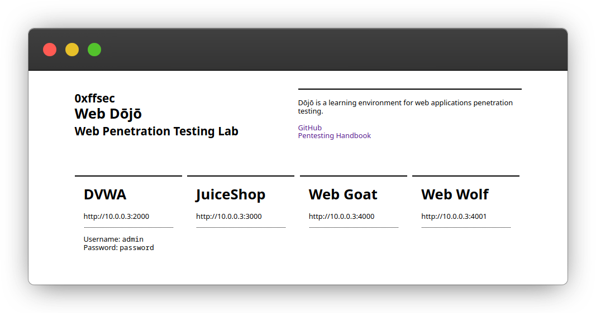
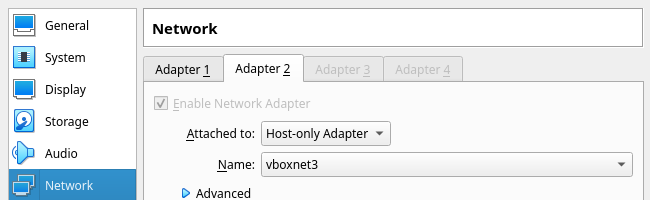

<h1 align="center">
Web Dōjō
<br>
<small>Web Penetration Testing Lab</small>
</h1>
<p align="center">
<b>dōjō</b> [doꜜː(d)ʑoː] : a hall for immersive learning or meditation.
</p>

## Overview

Dōjō is a learning environment
for web application penetration testing.

The dojo runs inside a CentOS virtual machine (VM)
and includes a collection of vulnerable applications.
Each application runs in isolation in [Docker](https://www.docker.com/) containers.

The environment is managed by [Vagrant](https://www.vagrantup.com/) using [VirtualBox](https://www.virtualbox.org/) and provisioned with [Ansible](https://www.ansible.com/).
Running applications are configured from the [applications.yml](provisioning/applications.yml) file.

### Available Applications

- [Damn Vulnerable Web App (DVWA)](http://www.dvwa.co.uk/)
- [OWASP JuiceShop](https://owasp.org/www-project-juice-shop/)
- [WebGoat 8.0](https://github.com/WebGoat/WebGoat)

## Requirements

- [Vagrant](https://www.vagrantup.com/)

## Quick Start

Clone the repository:

```sh
git clone https://github.com/0xffsec/webdojo.git
```

Start and provision the vagrant environment:

```sh
cd webdojo
vagrant up
```

:martial_arts_uniform: Done. Browse the dojo: http://10.0.0.3

## The Dojo

The dojo is a single web application (SPA)
that serves as a menu for the available apps.
It is binded to port `80`
and accessible from http://10.0.0.3.



## Network

The installation creates a [Host-Only Network](https://docs.oracle.com/en/virtualization/virtualbox/6.0/user/network_hostonly.html) with address `10.0.0.1/24` and DHCP disabled.
The VM is attached to it with the static IP `10.0.0.3`.

```sh
$ vboxmanage list hostonlyifs

Name:            vboxnet3
GUID:            786f6276-656e-4474-8000-0a0027000004
DHCP:            Disabled
IPAddress:       10.0.0.1
NetworkMask:     255.255.255.0
…
```

If your pentesting machine lives in a different VM
add a new adaptor attached to the newly created network.



The ip has te be set manually inside the vm.

## Contributing

Contributions are welcome, and they are greatly appreciated! Every little bit helps, and credit will always be given.

The best way to send feedback is to file an issue at https://github.com/0xffsec/webdojo/issues
